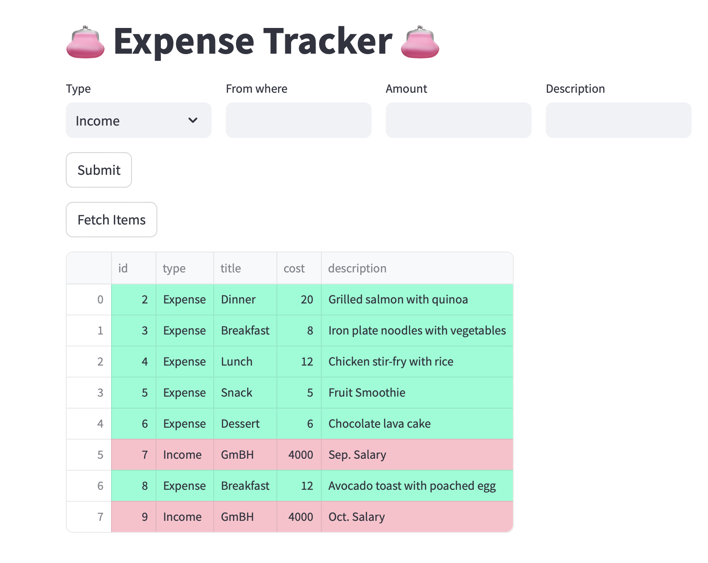

# Expense Tracker

👛 **Expense Tracker** is a web application that allows users to track their expenses and income easily. This application is built with **Streamlit** for the frontend and **Flask** for the backend, using **SQLite** as the database.

## Features

- Add income and expense entries with descriptions.
- View the list of recorded items in a user-friendly table.
- Conditional formatting for better visual distinction between income and expenses.

  ### User Interface

  

## Tech Stack

- **Frontend**: Streamlit
- **Backend**: Flask
- **Database**: SQLite
- **Libraries**:
  - `Flask-SQLAlchemy`
  - `Flask-RESTful`
  - `Pandas`
  
## Usage

**1. Add Entry**:
- Select the type of entry (Income or Expense).
- Fill in the required fields based on the type.
- Click the "Submit" button to add the entry.

**2. View Entries**:
- Click the "Fetch Items" button to display all recorded items in a table format.

**3. Visual Indicators**:
- Expenses will be highlighted in a light green color.
- Income will be highlighted in light pink for easy differentiation.

## API Endpoints
The backend provides the following RESTful API endpoints:

- `GET /api/items` - Retrieve all items
- `POST /api/items` - Add a new item
- `GET /api/items/<id>` - Retrieve a specific item by ID
- `PUT /api/items/<id>` - Update a specific item by ID
- `DELETE /api/items/<id>` - Delete a specific item by ID

## License
This project is licensed under the MIT License. See the LICENSE file for more details.
